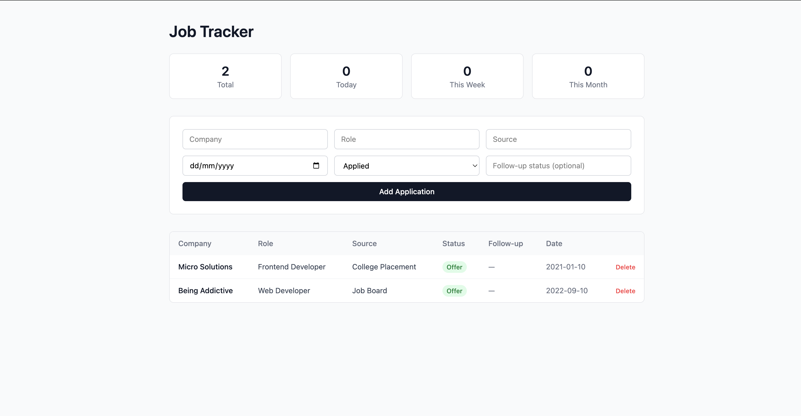

# Job Tracker

A full stack application for tracking job applications, built to replace a manual spreadsheet workflow. Tracks company, role, source, status, follow-up notes, and date applied, with live counts by day, week, and month.

## Stack

- **Frontend:** React (Vite), Tailwind CSS, Axios
- **Backend:** ASP.NET Core Web API (C#), Entity Framework Core
- **Database:** PostgreSQL

## Features

- Full CRUD on job applications (create, read, update, delete)
- Status tracking: Applied, Assessment, Interviewing, Rejected, Offer
- Optional follow-up status per application
- Live summary counts (total, today, this week, this month)
- REST API with EF Core migrations for schema versioning

## Screenshot



## Running locally

### Backend
```bash
cd JobTracker.Api
dotnet restore
dotnet ef database update
dotnet run
```
API runs on `http://localhost:5075`.

### Frontend
```bash
cd job-tracker-web
npm install
npm run dev
```
App runs on `http://localhost:5173`.

### Requirements
- .NET SDK 10
- Node.js
- PostgreSQL running locally, with a database named `jobtracker`

## API endpoints

| Method | Route | Description |
|---|---|---|
| GET | `/api/jobapplications` | List all applications |
| GET | `/api/jobapplications/counts` | Get summary counts |
| POST | `/api/jobapplications` | Create an application |
| PUT | `/api/jobapplications/{id}` | Update an application |
| DELETE | `/api/jobapplications/{id}` | Delete an application |